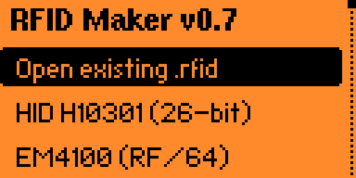
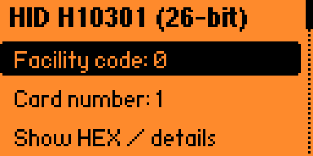

# RFID Maker

Created by: **KindaCharming**

Create and edit Flipper Zero **125 kHz RFID** files using decimal facility codes and card numbers.

**Choose a type → enter facility code and card number → preview HEX → save or emulate.**

RFID Maker provides a decimal alternative to the built-in RFID app's **Add manually** workflow. It can also open existing `.rfid` files, recognize supported layouts, and save edited copies.

## Features

- 18 decimal presets, with range checks and extra fields where a format requires them.
- HEX preview, verified Proxmark ID/raw values, and the firmware's interpretation of the generated data.
- Import existing RFID files and automatically fill supported decimal fields.
- Advanced HEX editing for other protocols and layouts supported by the firmware.
- Save new `.rfid` files without overwriting existing files.
- Emulate directly from the app, with a magenta LED pulse and Back to stop.
- Embedded monochrome app icon and an **About** screen with creator credit.

## Compatibility

The downloadable **v0.8** binary targets **Momentum mntm-012, Flipper Zero F7, API 87.1**. Other firmware versions may require rebuilding against their own SDK. A separate binary has also been built and passed SDK import checks against **official firmware 1.4.3 (F7 / API 87.1)**. Physical-device checks on that official release remain before catalog submission.

This app uses the low-frequency RFID subsystem. It does not handle 13.56 MHz NFC cards. Some RFID protocols use an ID rather than a facility code; the app shows the fields appropriate to the selected preset.

## Install and use

[Download v0.8 for Momentum mntm-012](https://github.com/jeremydbean/FlipperRFIDMaker/raw/refs/heads/main/dist/rfid_maker.fap) · [Download v0.8 for official firmware 1.4.3](https://github.com/jeremydbean/FlipperRFIDMaker/raw/refs/heads/main/dist/official/rfid_maker.fap)

1. Download the binary matching your firmware and copy `rfid_maker.fap` to `SD/apps/RFID/rfid_maker.fap` using qFlipper or an SD card reader.
2. Open **Apps → RFID → RFID Maker**.
3. Select a format and edit its decimal fields. Most fields use the numeric keypad. Wide IDs use decimal text entry because Flipper's numeric keypad API is limited to signed 32-bit values.
4. Select **Show HEX / details** to see the exact bytes that will be stored in the `.rfid` file and the firmware's interpretation of those bytes. Back returns to the fields.
5. Select **Save .rfid**, enter a name without the extension, and save. Files go to `SD/lfrfid/<name>.rfid`. Existing names are rejected rather than overwritten.
6. Open the saved file through the normal RFID app, or select **Emulate** here. Back stops emulation.
7. Select **About** at the bottom of the type menu to see the version and **Created by: KindaCharming** credit.

## Open and edit an existing file

1. Select **Open existing .rfid** at the top of the type menu. The browser starts in `SD/lfrfid` and can navigate elsewhere on the SD card.
2. Choose a file. The app reads its key type automatically using Flipper's native RFID loader.
3. For a supported decimal layout, the app fills the FC, card number, and extra fields from the file. Edit the fields, then use **Show HEX / details** to inspect the result.
4. Select **Save as .rfid**. The suggested name is `<original>_copy`; choose another name if it already exists. The copy is saved under `SD/lfrfid`. The original is never overwritten.

A decimal form is selected only if decoding and re-encoding reproduces every loaded data byte. Unknown layouts, unexpected padding/check bits, or additional payload stay in the HEX editor with their data preserved. You can still inspect, edit, emulate, and save a new file from that editor. This prevents an unsupported layout from being silently converted into another credential.

The new file contains the normal Flipper RFID header, key type, and data. Source-file comments and other non-key text are not copied. Legacy RFID files are normalized by Flipper's native loader before editing.

The included binary targets mntm-012. If your installed firmware reports an API mismatch, rebuild using the SDK corresponding to your firmware. Do not bypass the firmware's compatibility check.

## Decimal presets

| Type | Decimal inputs |
| --- | --- |
| HID H10301, 26-bit | FC 0–255; card 0–65535 |
| EM4100, RF/64, RF/32, RF/16 | FC 0–255; card 0–65535; ID prefix 0–65535 |
| Indala, 26-bit | FC 0–255; card 0–65535 |
| IO Prox XSF | FC 0–255; card 0–65535; version 0–255 |
| AWID, 26-bit | FC 0–255; card 0–65535 |
| Pyramid, 26-bit | FC 0–255; card 0–65535 |
| Gallagher | FC 0–65535; card 0–16777215; region and issue level 0–15 |
| Keri | FC 0–31; card 0–4194303 |
| Securakey, 26-bit | FC 1–255; card 0–65535; two check bytes 0–255 |
| Viking / PAC/Stanley | Card ID 0–4294967295; no facility code |
| Jablotron | 40-bit card data as a decimal integer; no facility code |
| IDTECK | 32-bit card ID; fixed IDTK factory word |
| Paradox | FC 0–255; card 0–65535 |
| GProx II, 26-bit | FC 0–255; card 0–65535; profile 0–65535 |
| HID H10306, 34-bit | FC 0–65535; card 0–65535 |

These are **18 presets**. A protocol name does not uniquely identify every possible card layout. AWID and HID can carry other layouts; this app's decimal presets support only the specified layouts.

EM4100 is fundamentally a 40-bit ID. The FC/card form follows Flipper's displayed convention, with the first 16 bits supplied separately as the ID prefix. Match all five ID bytes when recreating an existing credential.

Securakey's SDK copies two check bytes from card data without documenting how to generate them. The form exposes those bytes; FC/card alone cannot establish their correct values. Defaults of zero are not a claim that a particular reader will accept the result. The 32-bit Securakey layout is not offered as a decimal preset.

**All types (advanced HEX)** exposes every protocol in the selected SDK, including formats without an implemented decimal form. This is a compatibility fallback, not universal FC/card conversion. Electra, FDX-A/B, HID extended, Nexwatch, Noralsy, and InstaFob still use this fallback in this version. Other subformats also require raw data.

## Example

For HID H10301, facility code **150**, card number **10016**:

```text
Filetype: Flipper RFID key
Version: 1
Key type: H10301
Data: 96 27 20
```

See `examples/H10301_FC150_CN10016.rfid`. The HEX preview shows `.rfid` protocol data, not the entire on-air waveform. The selected firmware encoder generates modulation, preambles, and protocol framing. Indala, AWID, Paradox, and GProx II also require conversion logic in this app for their stored payloads.

## Proxmark HEX

**Show HEX / details** displays the `.rfid` data first, then a separate Proxmark value for the supported conversions:

- HID H10301 and H10306: the raw HID ID, including parity and the format-length marker.
- EM4100 RF/64, RF/32 and RF/16: the complete 40-bit ID used by Proxmark EM410x commands. Those commands encode RF framing separately.
- Indala26: the 64-bit frame representing the data this app emulates.
- AWID: the 96-bit frame, including its preamble and group parity.

Other layouts display **Not implemented for this layout**. An advanced HEX import without an exactly recognized decimal preset also uses that message.

H10301 additionally shows **Sheet-style HEX**, matching the convention of a header plus Wiegand payload without the format-length marker. That value differs from the complete Proxmark raw ID. Use **Proxmark raw HEX** when a Proxmark command expects the complete HID ID; the sheet-style value is provided for comparison with existing conversion sheets.

These displays do not change the saved `.rfid` data or the emulated credential. Formatting and protocol definitions follow [Proxmark3](https://github.com/RfidResearchGroup/proxmark3/tree/e6d7cd1f9d330b930073f32cda06e308774cd36d/client/src) and the Flipper firmware encoders. No user credential list is included in the project.

## Troubleshooting

- **API mismatch:** rebuild with the SDK for your installed firmware. The included download targets mntm-012.
- **Green LED while emulating:** install the latest binary and confirm the menu says **RFID Maker v0.8**. This version alternates magenta/off with a 10 ms pulse every 100 ms while emulating, including when USB charging is active. Back releases the LED so the normal charging/status indicator can return. Physical-device confirmation of this change is still pending.
- **Imported file opens in HEX:** its data does not exactly match an implemented decimal preset. The app preserves the bytes instead of guessing a facility code and card number.
- **Filename already exists:** choose a new name. Imported files default to a name ending in `_copy`.
- **Reader does not accept the card:** verify the exact protocol, layout, and all additional fields. A matching facility code and card number alone may not reproduce the original credential.

## Screenshots

Type menu and decimal fields, exported by the author from qFlipper (v0.7):





## Flipper Apps Catalog status

RFID Maker has **not yet been submitted**. Public source, license, icon, metadata, catalog description and changelog are ready. v0.8 builds against official release 1.4.3 and Momentum mntm-012, with SDK import and ARM controller checks passing.

Original qFlipper device-screen exports are included unchanged. Physical-device validation on official firmware remains before submission. See the [publishing checklist and manifest template](docs/publishing.md), [catalog description](docs/catalog-description.md), and [changelog](docs/changelog.md).

## Build

Install Python and `ufbt`, then run inside this source directory for official release firmware:

```sh
python -m pip install ufbt
ufbt update --channel=release --hw-target=f7
ufbt
```

For the Momentum mntm-012 build:

```sh
python -m pip install ufbt
ufbt update --hw-target=f7 --url=https://github.com/Next-Flip/Momentum-Firmware/releases/download/mntm-012/flipper-z-f7-sdk-mntm-012.zip
ufbt
```

The resulting binary is `dist/rfid_maker.fap`. Use a separate `UFBT_HOME` if you want to keep this SDK separate from another project's SDK.

## Validation

- Successful builds and SDK import checks for official firmware 1.4.3 and Momentum mntm-012, F7 / API 87.1.
- The actual ARM C encoders and decoders executed in Unicorn: **1,836 round-trip vectors across all 18 presets**, including minimum/maximum and deterministic random values.
- Checked against independent Python bit-layout calculations, including Indala parity/checksum, AWID Wiegand parity, Keri bit mapping, Paradox CRC, GProx framing, and HID H10306 framing.
- Checked invalid field values, wrong buffer sizes, output buffer bounds, and 13 decimal parser cases including 64-bit overflow.
- Executed 714 Proxmark ID/raw vectors across seven presets, plus 2,004 H10301/H10306 vectors compared with the actual Proxmark3 C packing functions (reference commit e6d7cd1f9d330b930073f32cda06e308774cd36d).
- Checked 450 arbitrary payloads: successful decimal decoding must preserve every byte; failed decoding must leave the output fields unchanged.
- Executed the actual ARM import controller with mocked SDK services: valid AWID import, browser cancellation, invalid-file recovery, and unknown-layout fallback. Verified the browser opens after the input callback and the dispatcher stays running.
- Executed the emulation controller with a modeled notification LED layer: with underlying green active, emulation shows magenta/off pulses, Back restores green and stops the RFID worker, repeated cleanup is harmless, and restart/exit cleanup releases both again. These are software tests; visible behavior on a physical device remains unverified.
- Author-supplied screenshots confirm the v0.7 type menu and decimal form render on a physical Flipper. Official-firmware device checks, complete SD-card workflows, and reader acceptance remain unverified. Software tests establish payloads and controller behavior, not RF performance.

To rerun:

```sh
python -m pip install unicorn pyelftools
python tests/test_formats.py /path/to/arm-none-eabi-gcc
python tests/test_import.py /path/to/arm-none-eabi-gcc /path/to/sdk_headers
python tests/test_proxmark.py /path/to/arm-none-eabi-gcc /path/to/proxmark3-source
```

The import regression test accepts an optional local AWID `.rfid` file as its third argument. That file is read in place and is not copied into the project.

## References and license

- [rfidfuzzer](https://github.com/jeremydbean/rfidfuzzer)
- [Flipper RFID Playlist Generator](https://github.com/jeremydbean/Flipper-RFID-Playlist-Generator)
- [Flipper LF RFID protocol implementations](https://github.com/flipperdevices/flipperzero-firmware/tree/7f0b6e1c14431708cfde75ae1ba13df59e868041/lib/lfrfid/protocols)
- [Momentum mntm-012 SDK](https://github.com/Next-Flip/Momentum-Firmware/releases/tag/mntm-012)

App source is GPL-3.0-or-later; see LICENSE. Protocol mappings follow the public Flipper implementations. No playlist-generation code was copied into this app.
